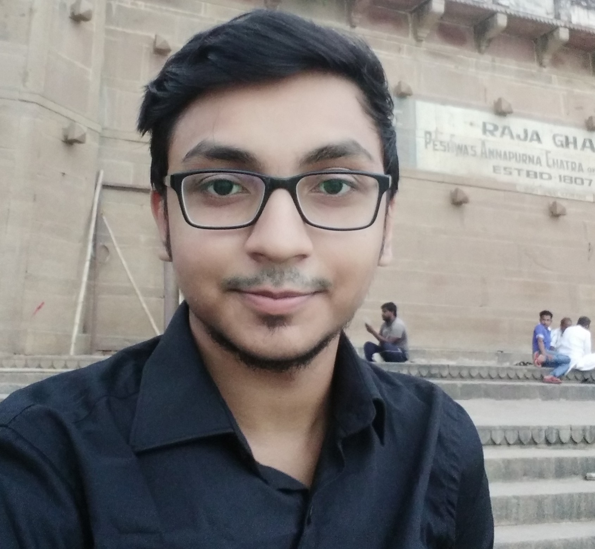

## About Me

Hi! I am a sophomore year student of B.Tech. Computer Science and Engineering at Indian Institute of Technology, Patna.

## Skills and Interests

1.Machine Learning

2.Android

3.C

4.Java

5.Python

6.JavaScript

## Achievements and Academic Performance

Year | Category | Percentage/Grade
-----|-------|--------
2015 | Standard 12th | 93.4% (CBSE)
2013 | Standard 10th | 9.6/10 (CBSE)

1. 2nd position in Swarnakala Merit Test 2013 organized by Rotary Club in District
2. Runners up TCS IT Wiz 2014(quiz on Information Technology) and 2nd runners up in TCS IT Wiz 2015

---

> To a great mind, nothing is little

